# App CVM Boot Sequence Diagram (KMS Mode)

## Sequence: App CVM Boot and Key Provisioning

```mermaid
sequenceDiagram
    participant VMM as VMM (Host)
    participant CVM as App CVM
    participant Prep as dstack-prepare.sh
    participant KMS as KMS (CVM)
    participant Auth as auth-simple (Host)
    participant GW as Gateway (CVM)
    participant App as App Container(s)
    participant GA as Guest Agent

    Note over VMM,App: Phase 1: CVM Boot
    VMM->>CVM: Start CVM (TDX)
    CVM->>CVM: Boot OS Image
    CVM->>Prep: Execute dstack-prepare.sh

    Note over Prep: Measure App Info
    Prep->>Prep: measure_app_info()<br/>- compose_hash (sha256 of app-compose.json)<br/>- app_id (truncated compose_hash)<br/>- instance_id
    Prep->>Prep: emit_runtime_event()<br/>Write app_id, compose_hash,<br/>instance_id to TDX event log (RTMR[3])

    Note over Prep,KMS: Phase 2: Request App Keys from KMS
    Prep->>KMS: GetTempCaCert()
    KMS-->>Prep: temp_ca_cert + temp_ca_key + ca_cert

    Prep->>Prep: Generate RA-TLS client cert<br/>signed by temp_ca_key<br/>(includes TDX attestation)
    Prep->>Prep: Create mTLS client<br/>(client cert = RA-TLS,<br/>CA trust = ca_cert from KMS)

    Prep->>KMS: GetAppKey(vm_config)<br/>via mTLS

    Note over Prep: Verify KMS Identity (cert_validator)
    Prep->>Prep: Verify KMS server cert:<br/>- special_usage == "kms:rpc"<br/>- If TDX attestation present:<br/>  emit mr-kms to RTMR[3]

    Note over KMS: Verify App CVM via mTLS
    KMS->>KMS: Verify RA-TLS client cert<br/>(TDX attestation embedded in cert)

    Note over KMS,Auth: Phase 3: Authorization Check
    KMS->>KMS: ensure_app_boot_allowed()<br/>Extract boot_info from attestation:<br/>app_id, compose_hash, device_id,<br/>tcb_status, os_image_hash
    KMS->>Auth: POST /bootAuth/app<br/>{boot_info}

    Auth->>Auth: Check tcb_status == "UpToDate"
    Auth->>Auth: Check os_image_hash<br/>in osImages whitelist
    Auth->>Auth: Check app_id exists<br/>in apps config
    Auth->>Auth: Check compose_hash<br/>in app's composeHashes
    Auth->>Auth: Check device_id<br/>(if allowAnyDevice=false)

    alt Authorized
        Auth-->>KMS: {isAllowed: true, gatewayAppId}
        KMS->>KMS: Derive app keys from root keys:<br/>- disk_crypt_key = HKDF(ca_key, app_id + instance_id + "app-disk-crypt-key")<br/>- env_crypt_key = x25519(HKDF(ca_key, app_id + "env-encrypt-key"))<br/>- k256_key = HKDF(k256_root, app_id + "app-key")
        KMS-->>Prep: AppKeyResponse<br/>(disk_crypt_key, env_crypt_key,<br/>k256_key, ca_cert, gateway_app_id)
    else Not Authorized
        Auth-->>KMS: {isAllowed: false, reason: "..."}
        KMS-->>Prep: Error: "App not allowed"
        Prep->>CVM: Reboot/Shutdown
    end

    Note over Prep: Phase 4: Verify & Mount Disk
    Prep->>Prep: verify_key_provider_id()<br/>Compare KMS CA pubkey<br/>with key_provider_id<br/>(if specified in app-compose.json)
    Prep->>Prep: Save app keys<br/>to host-shared/.appkeys.json
    Prep->>Prep: Mount encrypted disk<br/>using disk_crypt_key
    Prep->>Prep: emit_runtime_event("system-ready")

    Note over Prep: Phase 5: Post-mount Setup (Stage1)
    Prep->>Prep: unseal_env_vars()<br/>Decrypt env vars with env_crypt_key<br/>(AES-256-GCM after x25519 DH)
    Prep->>Prep: Write decrypted env to<br/>/dstack/.decrypted_env
    Prep->>Prep: Setup Guest Agent config
    
    Note over Prep,GW: Phase 5a: Register with Gateway
    Prep->>Prep: GatewayContext::setup()
    Prep->>Prep: Generate or load WireGuard keys<br/>(wg genkey / wg pubkey)
    Prep->>Prep: Request client RA-TLS cert<br/>from KMS via CertRequestClient
    Prep->>KMS: SignCert(CSR + TDX quote)
    KMS->>KMS: Verify attestation + auth check<br/>Derive App CA → Sign CSR
    KMS-->>Prep: Client cert chain<br/>(cert + app_ca + root_ca)

    Prep->>Prep: Create mTLS client for Gateway<br/>(verify gateway_app_id<br/>in server cert)
    Prep->>GW: RegisterCvm(wg_public_key)<br/>via mTLS (client cert = KMS-signed RA-TLS)

    Note over GW: Verify App CVM
    GW->>GW: Extract app_info from<br/>client RA-TLS cert<br/>(app_id, instance_id)
    GW->>GW: ensure_app_authorized(app_info)<br/>(optional auth check)
    GW->>GW: Allocate WireGuard IP<br/>Add peer to WG config
    GW-->>Prep: RegisterCvmResponse<br/>(client_ip, gateway WG peers,<br/>agent config: domain, port)

    Prep->>Prep: Write /etc/wireguard/dstack-wg0.conf<br/>Configure iptables rules
    Prep->>Prep: wg-quick up dstack-wg0

    Note over Prep: Phase 5b: Docker Setup
    Prep->>Prep: Setup Docker registry<br/>(if configured)

    Note over Prep,App: Phase 6: Start Docker Compose
    Prep->>App: Start docker-compose<br/>(app container(s))

    Note over App,GA: Phase 7: App Running
    App->>App: Application starts
    App->>GA: (optional) get_key()<br/>via /var/run/dstack.sock<br/>Derive keys from k256_key
    App->>GA: (optional) get_tls_key()<br/>via /var/run/dstack.sock<br/>Get KMS-signed TLS cert
    App->>GA: (optional) get_quote()<br/>via /var/run/dstack.sock<br/>Get TDX quote for remote attestation

    Note over VMM,App: App CVM Ready!
```

## Key Points

1. **dstack-prepare.sh**: A bash script included in the OS image that runs as a systemd service at CVM boot. It calls `dstack-util setup` which performs key provisioning (`setup_fs()`) and post-mount setup (`Stage1::setup()`), then starts docker-compose.

2. **GetAppKey is automatic**: Called during CVM boot by `dstack-util setup` in `setup_fs()`, before the disk is mounted. The app developer does not need to call it.

3. **Mutual attestation between App and KMS**:
   - **App verifies KMS**: Checks KMS RA-TLS server cert (`special_usage == "kms:rpc"`), emits `mr-kms` to RTMR[3], and calls `verify_key_provider_id()` after receiving keys.
   - **KMS verifies App**: Extracts TDX attestation from RA-TLS client cert (mTLS), then calls auth-simple (`POST /bootAuth/app`) to authorize the app.

4. **auth-simple checks 5 things** for app authorization: `tcb_status`, `os_image_hash`, `app_id`, `compose_hash`, and `device_id` (if `allowAnyDevice=false`).

5. **Keys are derived by KMS** from its root keys:
   - `disk_crypt_key`: `HKDF(ca_key, app_id + instance_id + "app-disk-crypt-key")` — unique per app instance
   - `env_crypt_key`: `x25519(HKDF(ca_key, app_id + "env-encrypt-key"))` — same for all instances of same app
   - `k256_key`: `HKDF(k256_root, app_id + "app-key")` — same for all instances of same app

6. **Gateway registration (Phase 5a)**: Unlike the gateway CVM (which skips this step), app CVMs register with the gateway to join the WireGuard network:
   - The app CVM requests a KMS-signed RA-TLS client cert via `SignCert`
   - It connects to the gateway via mTLS, verifying the gateway's `app_id` matches `gateway_app_id` received from KMS
   - The gateway verifies the app's identity from the RA-TLS client cert and allocates a WireGuard IP
   - The app configures WireGuard with the gateway as peer

7. **Environment variable decryption**: Encrypted env vars are decrypted using `env_crypt_key` (X25519 Diffie-Hellman + AES-256-GCM). The operator encrypts env vars using the public key obtained via `GetAppEnvEncryptPubKey`.

8. **Guest Agent services** (available at `/var/run/dstack.sock`): After boot, the app can use the Guest Agent to:
   - `get_key()`: Derive purpose-specific keys from `k256_key`
   - `get_tls_key()`: Generate a new P256 key and get a KMS-signed RA-TLS certificate
   - `get_quote()`: Get a TDX quote for remote attestation by external verifiers

9. **Differences from Gateway CVM boot**:

   | Aspect | App CVM | Gateway CVM |
   |--------|---------|-------------|
   | Gateway registration | **Yes** (Phase 5a) | **Skipped** (gateway_enabled=false) |
   | WireGuard setup | Done by `dstack-util` during boot | Done by gateway container itself |
   | env_crypt_key | Derived by KMS, used to decrypt env vars | Derived by KMS, used to decrypt env vars |
   | RPC cert generation | Optional, via Guest Agent `get_tls_key()` | Done by gateway container at init |
   | Proxy cert | N/A | Self-signed wildcard or ACME |

## Endpoints Reference

- **KMS RPC**: `https://kms-host:9201/prpc` (container port 8000, mapped to 9201)
- **auth-simple**: configurable via `AUTH_WEBHOOK_URL` (default port 3000)
- **Gateway RPC**: `https://gateway-host:9202/prpc` (container port 8000, mapped to 9202)
- **Guest Agent (inside CVM)**: port 8090 internal, accessed via `/var/run/dstack.sock` unix socket
- **App ports**: mapped according to docker-compose port definitions
