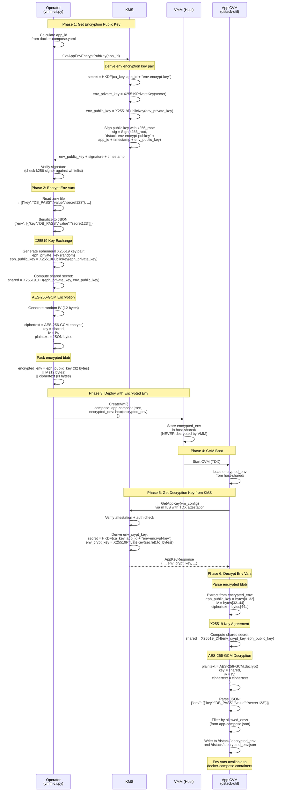

# Environment Variables Encryption/Decryption Sequence

## Overview

Environment variables are encrypted **by the operator** (via `vmm-cli.py`) before deployment, and decrypted **inside the CVM** at boot time. Neither the VMM nor the KMS ever see the plaintext env vars.

## Sequence Diagram



## Cryptographic Details

### Key Derivation (KMS side)

The KMS derives **the same X25519 key pair** for both `GetAppEnvEncryptPubKey` (returns public key) and `GetAppKey` (returns private key):

```
secret = HKDF(ca_key, app_id || "env-encrypt-key")   // 32 bytes
env_private_key = X25519PrivateKey(secret)
env_public_key  = X25519PublicKey(env_private_key)
```

- `GetAppEnvEncryptPubKey` → returns `env_public_key` (to operator for encryption)
- `GetAppKey` → returns `env_private_key` as `env_crypt_key` (to CVM for decryption)

### Encryption (Operator side - vmm-cli.py)

```
eph_sk, eph_pk = X25519.generate()           // ephemeral key pair
shared = X25519_DH(eph_sk, env_public_key)   // 32-byte shared secret
IV = random(12)                               // 12-byte nonce
ciphertext = AES-256-GCM(shared, IV, JSON)   // authenticated encryption
output = eph_pk || IV || ciphertext           // concatenated blob
```

### Decryption (CVM side - dstack-util)

```
eph_pk     = output[0..32]                    // extract ephemeral public key
IV         = output[32..44]                   // extract nonce
ciphertext = output[44..]                     // extract ciphertext
shared = X25519_DH(env_crypt_key, eph_pk)     // same shared secret
plaintext = AES-256-GCM.decrypt(shared, IV, ciphertext)
```

### Why This Works

The shared secret is identical on both sides because of the X25519 Diffie-Hellman property:

```
X25519_DH(eph_sk, env_public_key) == X25519_DH(env_crypt_key, eph_pk)
```

Both compute the same elliptic curve point: `eph_sk * env_private_key * G`

## Security Properties

| Property | Guarantee |
|----------|-----------|
| **Confidentiality** | Only someone with `env_crypt_key` (= the CVM after KMS attestation) can decrypt |
| **Forward secrecy** | Each encryption uses an ephemeral key; compromising `env_crypt_key` later doesn't reveal previous ciphertexts without the ephemeral private key (which is discarded) |
| **Integrity** | AES-GCM provides authenticated encryption — tampering is detected |
| **VMM blindness** | The VMM only sees the encrypted blob, never the plaintext |
| **KMS blindness** | The KMS never sees the encrypted env vars — it only provides keys |
| **App-specific** | Each app has a unique `env_crypt_key` derived from its `app_id` |
| **Instance-shared** | All instances of the same app share the same `env_crypt_key` (derived from `app_id` only, not `instance_id`) |

## Data Flow Summary

```
Operator                    KMS                      VMM              CVM
   │                         │                        │                │
   │──GetAppEnvEncryptPubKey─▶│                        │                │
   │◀──env_public_key────────│                        │                │
   │                         │                        │                │
   │  encrypt(env_vars,      │                        │                │
   │    env_public_key)       │                        │                │
   │──CreateVm(encrypted)───────────────────────────▶│                │
   │                         │                        │──encrypted────▶│
   │                         │                        │                │
   │                         │◀──GetAppKey(attestation)───────────────│
   │                         │──env_crypt_key────────────────────────▶│
   │                         │                        │                │
   │                         │                        │      decrypt(encrypted,
   │                         │                        │       env_crypt_key)
   │                         │                        │         = env_vars
```
