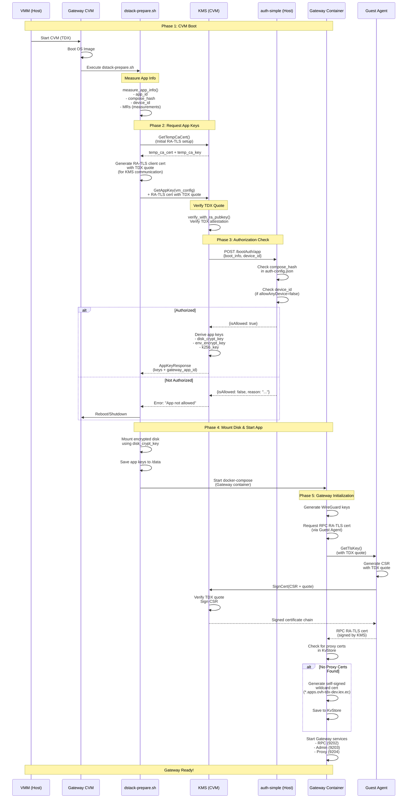

# Gateway Boot Sequence Diagram

## Sequence: Gateway CVM Boot and Key Provisioning

## Key Points

1. **dstack-prepare.sh**: A bash script included in the OS image that runs as a systemd service (`dstack-prepare.service`) at CVM boot. It prepares the environment (TDX setup, disk mounting) and calls `dstack-util setup` which performs the actual app key provisioning.

2. **GetAppKey is automatic**: Called during CVM boot by `dstack-util setup` (invoked by `dstack-prepare.sh`) in the `setup_fs()` phase.

3. **Attestation happens first**: KMS verifies TDX quote before calling auth-simple.

4. **auth-simple is a webhook**: KMS calls it via HTTP POST to `/bootAuth/app`.

5. **Keys are derived**: KMS derives app-specific keys from root keys using app_id.

6. **Disk encryption**: The `disk_crypt_key` is used to mount the encrypted data disk.

7. **Two types of RA-TLS certificates**:
   - **Boot-time RA-TLS**: Used during `GetAppKey` to authenticate the CVM to KMS (Phase 2)
   - **RPC RA-TLS**: Gateway's RPC server certificate signed by KMS after container startup (Phase 5)

## Endpoints Reference

- **KMS RPC**: `https://kms.ovh-tdx-dev.iex.ec:9201/prpc`
- **auth-simple**: `http://127.0.0.1:3001/bootAuth/app` (from KMS CVM perspective: `http://10.0.2.2:3001`)
- **Guest Agent logs**: `http://127.0.0.1:9206/logs/<container-name>` (Gateway) or `http://127.0.0.1:9205/logs/<container-name>` (KMS)
