# Gateway Boot Sequence Diagram

## Sequence: Gateway CVM Boot and Key Provisioning

```mermaid
sequenceDiagram
    participant VMM as VMM (Host)
    participant CVM as Gateway CVM
    participant Prep as dstack-prepare.sh
    participant KMS as KMS (CVM)
    participant Auth as auth-simple (Host)
    participant App as Gateway Container
    participant GuestAgent as Guest Agent

    Note over VMM,App: Phase 1: CVM Boot
    VMM->>CVM: Start CVM (TDX)
    CVM->>CVM: Boot OS Image
    CVM->>Prep: Execute dstack-prepare.sh
    
    Note over Prep: Measure App Info
    Prep->>Prep: measure_app_info()<br/>- compose_hash (sha256 of app-compose.json)<br/>- app_id (truncated compose_hash)<br/>- instance_id
    Prep->>Prep: emit_runtime_event()<br/>Write app_id, compose_hash,<br/>instance_id to TDX event log (RTMR[3])
    
    Note over Prep,KMS: Phase 2: Request App Keys
    Prep->>KMS: GetTempCaCert()<br/>(Initial RA-TLS setup)
    KMS-->>Prep: temp_ca_cert + temp_ca_key
    
    Prep->>Prep: Generate RA-TLS client cert<br/>with TDX quote<br/>(for KMS communication)
    
    Prep->>KMS: GetAppKey(vm_config)<br/>+ RA-TLS cert with TDX quote
    
    Note over Prep: Verify KMS Identity (cert_validator)
    Prep->>Prep: Verify KMS RA-TLS server cert:<br/>- special_usage == "kms:rpc"<br/>- If TDX attestation present:<br/>  emit mr-kms to RTMR[3]
    
    Note over KMS: Verify Gateway via mTLS
    KMS->>KMS: Verify RA-TLS client cert<br/>(TDX attestation embedded in cert)
    
    Note over KMS,Auth: Phase 3: Authorization Check
    KMS->>KMS: ensure_app_boot_allowed()<br/>Extract boot_info from attestation:<br/>app_id, compose_hash, device_id,<br/>tcb_status, os_image_hash
    KMS->>Auth: POST /bootAuth/app<br/>{boot_info}
    
    Auth->>Auth: Check tcb_status == "UpToDate"
    Auth->>Auth: Check os_image_hash<br/>in osImages whitelist
    Auth->>Auth: Check app_id exists<br/>in apps config
    Auth->>Auth: Check compose_hash<br/>in app's composeHashes
    Auth->>Auth: Check device_id<br/>(if allowAnyDevice=false)
    
    alt Authorized
        Auth-->>KMS: {isAllowed: true}
        KMS->>KMS: Derive app keys from ca_key:<br/>- disk_crypt_key (HKDF + app_id + instance_id)<br/>- env_crypt_key (x25519 from HKDF + app_id)<br/>- k256_key (from k256_root + app_id)
        KMS-->>Prep: AppKeyResponse<br/>(keys + ca_cert + gateway_app_id)
    else Not Authorized
        Auth-->>KMS: {isAllowed: false, reason: "..."}
        KMS-->>Prep: Error: "App not allowed"
        Prep->>CVM: Reboot/Shutdown
    end
    
    Note over Prep: Phase 4: Verify & Mount Disk
    Prep->>Prep: verify_key_provider_id()<br/>Compare KMS CA pubkey<br/>with key_provider_id<br/>(if specified in app-compose.json)
    Prep->>Prep: Save app keys<br/>to host-shared/.appkeys.json
    Prep->>Prep: Mount encrypted disk<br/>using disk_crypt_key
    
    Note over Prep: Phase 5: Post-mount Setup (Stage1)
    Prep->>Prep: Unseal env vars<br/>(decrypt with env_crypt_key)
    Prep->>Prep: Setup Guest Agent config
    Prep->>Prep: GatewayContext::setup()<br/>→ SKIPPED<br/>(gateway_enabled=false<br/>for the gateway CVM itself)
    Prep->>Prep: Setup Docker registry
    
    Note over Prep,App: Phase 6: Start Docker Compose
    Prep->>App: Start docker-compose<br/>(Gateway container)
    
    Note over App,GuestAgent: Phase 7: Gateway Container Init
    App->>App: entrypoint.sh:<br/>Generate/load WireGuard keys<br/>Create gateway.toml config
    App->>App: setup_wireguard()<br/>Configure WireGuard interface
    
    Note over App,KMS: RPC Certificate Generation
    App->>GuestAgent: get_tls_key()<br/>(via /var/run/dstack.sock)
    GuestAgent->>GuestAgent: Generate random P256 key
    GuestAgent->>GuestAgent: CertRequestClient (KMS mode):<br/>Generate RA-TLS cert, build CSR
    GuestAgent->>KMS: SignCert(CSR + TDX quote)
    KMS->>KMS: Verify TDX attestation<br/>+ auth check → Derive App CA<br/>→ Sign CSR
    KMS-->>GuestAgent: Signed certificate chain<br/>(cert + app_ca + root_ca)
    GuestAgent-->>App: RPC TLS key + cert chain
    
    App->>App: Get app_id from<br/>Guest Agent info()
    
    Note over App: Proxy Certificate Setup
    App->>App: Load proxy certs<br/>from KvStore (encrypted disk)
    
    alt No Proxy Certs Found
        App->>App: Generate self-signed<br/>wildcard cert<br/>(*.apps.{base_domain})
    end
    
    App->>App: Start Gateway services:<br/>- Proxy (port 443 → mapped 9204)<br/>- RPC (port 8000 → mapped 9202)<br/>- Admin (port 8001 → mapped 9203)
    
    Note over VMM,App: Gateway Ready!
```

## Key Points

1. **dstack-prepare.sh**: A bash script included in the OS image that runs as a systemd service at CVM boot. It calls `dstack-util setup` which performs key provisioning (`setup_fs()`) and post-mount setup (`Stage1::setup()`), then starts docker-compose.

2. **GetAppKey is automatic**: Called during CVM boot by `dstack-util setup` in `setup_fs()`, before the disk is mounted.

3. **Mutual attestation**: Both Gateway CVM and KMS verify each other:
   - **Gateway verifies KMS**: Checks KMS RA-TLS server cert (`special_usage == "kms:rpc"`), emits `mr-kms` to event log, and calls `verify_key_provider_id()` after receiving keys.
   - **KMS verifies Gateway**: Extracts TDX attestation from RA-TLS client cert (mTLS), then calls auth-simple.

4. **auth-simple checks 5 things**: `tcb_status`, `os_image_hash`, `app_id`, `compose_hash`, and `device_id` (if `allowAnyDevice=false`).

5. **Keys are derived**: KMS derives app-specific keys from `ca_key` (disk_crypt_key, env_crypt_key) and from `k256_key` root (k256_key), using `app_id` and `instance_id`.

6. **gateway_enabled=false for gateway CVM**: The gateway CVM itself does not register with another gateway. The `GatewayContext::setup()` step is skipped. WireGuard and cert generation are handled by the gateway container.

7. **Three types of RA-TLS certificates**:
   - **Boot-time RA-TLS**: Client cert for `GetAppKey` (Phase 2, generated by `dstack-util`)
   - **RPC RA-TLS**: Gateway's server cert generated via Guest Agent → KMS `SignCert` (Phase 7)
   - **Boot-time RA-TLS for SignCert**: Client cert for `SignCert` call (Phase 7, generated by Guest Agent using `tmp_ca_key/tmp_ca_cert` from KMS)

## Endpoints Reference

- **KMS RPC**: `https://kms-host:9201/prpc` (container port 8000, mapped to 9201)
- **auth-simple**: configurable via `AUTH_WEBHOOK_URL` (default port 3000)
- **Guest Agent (inside CVM)**: port 8090 internal, accessed via `/var/run/dstack.sock` unix socket
- **Gateway RPC**: port 8000 internal → mapped to 9202 on host
- **Gateway Admin**: port 8001 internal → mapped to 9203 on host
- **Gateway Proxy**: port 443 internal → mapped to 9204 on host
- **Gateway WireGuard**: UDP port 51820 internal → mapped to 9202 on host
