# KMS Boot Sequence Diagram (Local Key Provider)

## Sequence: KMS CVM Boot with Local SGX Key Provider

```mermaid
sequenceDiagram
    participant VMM as VMM (Host)
    participant CVM as KMS CVM
    participant Prep as dstack-prepare.sh
    participant HostAPI as Host API (VMM)
    participant SGXKP as SGX Key Provider<br/>(gramine-sealing-key-provider)
    participant App as KMS Container
    participant Auth as auth-simple (Host)
    participant OtherKMS as Other KMS (optional)

    Note over VMM,App: Phase 1: CVM Boot
    VMM->>CVM: Start CVM (TDX)
    CVM->>CVM: Boot OS Image
    CVM->>Prep: Execute dstack-prepare.sh
    
    Note over Prep: Measure App Info
    Prep->>Prep: measure_app_info()<br/>- compose_hash (sha256 of app-compose.json)<br/>- app_id (truncated compose_hash)<br/>- instance_id
    Prep->>Prep: emit_runtime_event()<br/>Write app_id, compose_hash,<br/>instance_id to TDX event log (RTMR[3])
    
    Note over Prep,SGXKP: Phase 2: Request Sealing Key
    Prep->>Prep: Generate keypair (pk, sk)
    Prep->>Prep: Create TDX quote<br/>with pk in report_data
    Prep->>HostAPI: GetSealingKey(quote)<br/>via VSOCK
    
    Note over HostAPI: Forward to SGX Key Provider
    HostAPI->>SGXKP: get_key(quote)<br/>TCP to localhost:3443
    
    Note over SGXKP: Verify KMS TDX Quote
    SGXKP->>SGXKP: Verify TDX quote<br/>Extract KMS measurements
    SGXKP->>SGXKP: Derive sealing key<br/>from KMS measurements<br/>(MRTD + RTMR[0-3])
    SGXKP->>SGXKP: Encrypt sealing key<br/>with KMS public key (pk)
    SGXKP->>SGXKP: Generate SGX quote<br/>with key_hash in report_data
    SGXKP-->>HostAPI: encrypted_key + provider_quote
    
    HostAPI-->>Prep: GetSealingKeyResponse<br/>(encrypted_key + provider_quote)
    
    Note over Prep: Verify SGX Key Provider
    Prep->>Prep: Verify SGX quote collateral<br/>(via PCCS)
    Prep->>Prep: Validate TCB status
    Prep->>Prep: Verify report_data<br/>contains hash(encrypted_key)
    Prep->>Prep: Extract MR enclave<br/>from SGX quote
    Prep->>Prep: Decrypt sealing key<br/>using private key (sk)
    
    Note over Prep: Phase 3: Derive Keys from Sealing Key
    Prep->>Prep: gen_app_keys_from_seed()<br/>Derive from sealing key:<br/>- app_key (P256, for self-signed RA-TLS cert)<br/>- disk_crypt_key (sha256 of disk_key DER)<br/>- k256_key (secp256k1)<br/>- env_crypt_key = empty (not derived locally)<br/>- Self-sign RA-TLS cert with app_key
    Prep->>Prep: verify_key_provider_id()<br/>Compare MR enclave<br/>with key_provider_id<br/>(if specified in app-compose.json)
    
    Note over Prep,App: Phase 4: Mount Disk & Start App
    Prep->>Prep: Mount encrypted disk<br/>using disk_crypt_key
    Prep->>Prep: Save app keys<br/>to host-shared/.appkeys.json
    Prep->>App: Start docker-compose<br/>(KMS container)
    
    Note over App: Phase 5: KMS Initialization
    App->>App: Check if root keys exist<br/>on encrypted disk
    
    alt Root Keys Exist (keys_exists() = true)
        App->>App: Load root keys from disk<br/>(ca_key, k256_key, rpc_key, tmp_ca_key)
    else First Boot (No Root Keys)
        alt Bootstrap (First KMS - Generate New Keys)
            Note over App: No auth server check<br/>for first KMS bootstrap
            App->>App: Generate root keys:<br/>- CA root key (ca_key)<br/>- K256 root key<br/>- RPC key (rpc_key)<br/>- Temp CA key (tmp_ca_key)
            App->>App: Create self-signed certificates:<br/>- CA cert (signed by ca_key)<br/>- RPC cert (signed by CA)
            App->>App: Generate TDX attestation<br/>with rpc_key pubkey<br/>(if quote_enabled)
            App->>App: Save root keys to disk<br/>+ bootstrap_info.json
        else Onboarding (Get Keys from Other KMS)
            Note over App,Auth: Phase 5a: Onboarding Authorization
            App->>OtherKMS: GetTempCaCert()
            OtherKMS-->>App: temp_ca_cert + temp_ca_key + ca_cert
            App->>App: Generate RA-TLS cert<br/>signed by temp CA<br/>(includes TDX attestation)
            App->>App: Create mTLS client<br/>using RA-TLS cert
            App->>OtherKMS: GetKmsKey(vm_config)<br/>via mTLS (client cert = RA-TLS)
            
            Note over OtherKMS: Verify Requesting KMS
            OtherKMS->>OtherKMS: Verify client RA-TLS cert<br/>(TDX attestation in TLS layer)
            OtherKMS->>OtherKMS: ensure_kms_allowed()<br/>Extract boot_info from attestation
            OtherKMS->>Auth: POST /bootAuth/kms<br/>{boot_info}
            
            Note over Auth: Check KMS Authorization
            Auth->>Auth: Check TCB status<br/>(must be "UpToDate")
            Auth->>Auth: Check osImageHash<br/>in allowed OS images
            Auth->>Auth: Check mrAggregated<br/>in kms.mrAggregated list
            Auth->>Auth: Check device_id<br/>(if kms.allowAnyDevice=false)
            
            alt Authorized
                Auth-->>OtherKMS: {isAllowed: true}
                OtherKMS->>OtherKMS: Return root keys<br/>(temp_ca_key + root keys)
                OtherKMS-->>App: KmsKeyResponse<br/>(root keys)
                App->>App: Save root keys to disk
            else Not Authorized
                Auth-->>OtherKMS: {isAllowed: false, reason: "..."}
                OtherKMS-->>App: Error: "KMS not allowed"
                App->>App: Shutdown/Abort
            end
        end
    end
    
    App->>App: update_certs()<br/>Regenerate certificates<br/>from stored keys<br/>(with fresh TDX attestation)
    App->>App: Start KMS HTTPS service<br/>(port 8000 internal,<br/>mapped to 9201 on host)
    
    Note over VMM,App: KMS Ready!
```



## Key Points

1. **dstack-prepare.sh**: A bash script included in the OS image that runs as a systemd service (`dstack-prepare.service`) at CVM boot. It prepares the environment (TDX setup, disk mounting) and calls `dstack-util setup` which performs the actual key provisioning.

2. **Local Key Provider is automatic**: Called during CVM boot by `dstack-util setup` (invoked by `dstack-prepare.sh`) when `--local-key-provider` flag is used.

3. **Mutual attestation**: Both KMS and SGX Key Provider verify each other:
   - **SGX Key Provider verifies KMS**: Validates KMS TDX quote before providing sealing key
   - **KMS verifies SGX Key Provider**: Validates SGX quote, TCB status, and key hash before accepting sealing key

4. **Sealing key derivation**: The SGX Key Provider derives the sealing key from:
   - SGX sealing key (hardware-bound)
   - KMS TDX measurements: MRTD + RTMR[0-2] (base image + VM config)
   - RTMR[3] (runtime application configuration)

5. **Key provider identity verification**: If `key_provider_id` is specified in `app-compose.json`, the KMS verifies that the SGX Key Provider's MR enclave matches the expected value.

6. **Disk encryption**: The `disk_crypt_key` is used to mount the encrypted data disk, allowing the KMS to persist root keys across reboots.

7. **Keys from sealing key vs root keys**: `gen_app_keys_from_seed()` derives from the sealing key:
   - `app_key` (P256): used to self-sign an RA-TLS certificate (saved as `ca_cert` in AppKeys)
   - `disk_crypt_key`: SHA-256 of the DER-serialized `disk_key` (used for disk encryption)
   - `k256_key` (secp256k1): derived but **not used** by the KMS container itself
   - `env_crypt_key`: set to **empty** in local mode. For other app CVMs calling `GetAppKey`, the KMS derives it from `ca_key` via `derive_dh_secret(ca_key, [app_id, "env-encrypt-key"])`
   
   The KMS container generates its own **separate root keys** during bootstrap: `ca_key` (root CA), `rpc_key` (for RPC certificates), `k256_key` (root secp256k1), and `tmp_ca_key` (temporary CA). These are the keys that matter for KMS operations. They are stored on the encrypted disk and reloaded on subsequent boots.

8. **Root key provisioning**: On first boot, the KMS either:
   - **Bootstrap** (first KMS): Generates new root keys (CA root key and K256 root key) **without auth server verification**. This is the initial KMS instance that creates the root keys.
   - **Onboarding** (subsequent KMS): Requests root keys from another KMS instance via `GetKmsKey` **with auth server verification**.

9. **KMS authorization with auth server**: **Only during onboarding** (not during bootstrap), when a KMS requests root keys from another KMS:
   - The **requesting KMS** sends its TDX quote (with attestation) to the **source KMS**
   - The **source KMS** verifies the TDX attestation and extracts boot info
   - The **source KMS** calls auth-simple (`POST /bootAuth/kms`) with the boot info
   - **auth-simple** checks the KMS authorization based on `kms` config in `auth-config.json`:
     - `tcbStatus`: Must be "UpToDate"
     - `osImageHash`: Must be in `osImages` list
     - `mrAggregated`: Must be in `kms.mrAggregated` list (if not empty)
     - `device_id`: Must be in `kms.devices` list (if `kms.allowAnyDevice=false`)
   - If authorized, the source KMS returns the root keys
   - If not authorized, the onboarding fails and the KMS cannot start

10. **Auth server role**: The `kms` entry in `auth-config.json` controls which KMS instances are allowed to onboard from other KMS instances. This ensures only authorized KMS instances can receive root keys. **Note**: The first KMS (bootstrap) does not require auth server verification since it is the initial instance creating the root keys.

## Endpoints Reference

- **KMS HTTPS (RPC + Web)**: `https://kms.ovh-tdx-dev.iex.ec:9201/prpc` (container listens on port 8000, mapped to 9201 on host)
- **SGX Key Provider**: `tcp://127.0.0.1:3443` (raw TCP, from VMM host perspective)
- **Host API**: VSOCK communication between CVM and VMM
- **auth-simple**: configurable via `AUTH_WEBHOOK_URL` (default port 3000, e.g. `http://host-ip:3000/bootAuth/kms`)
- **Guest Agent**: port 8090 internal, mapped to configured host port (e.g. 9205)

## Configuration

The SGX Key Provider must be configured in `vmm.toml`:

```toml
[key_provider]
enabled = true
address = "127.0.0.1"
port = 3443
```

The KMS is deployed with:

```bash
vmm-cli.py compose \
  --local-key-provider \
  --name kms \
  ...
```
